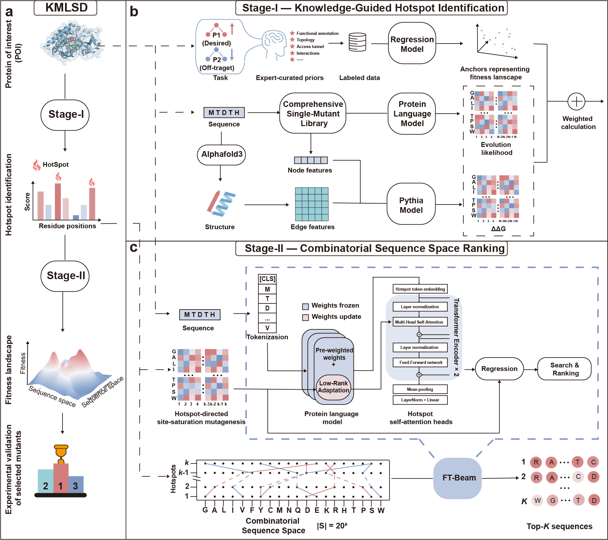

# KMLSD Framework



KMLSD is a two-stage framework:
- Stage-I (knowledge-guided hotspot identification)
- Stage-II (combinatorial sequence space ranking)

This repository is intentionally scoped to:
- Stage-I hotspot identification
- Stage-II surrogate-model training and combinatorial ranking

Included targets:
- P450 (CYP107D1)
- GB1

## Unified Repository Layout

- `stage1/score_hotspots.py`: Stage-I hotspot identification script (P450)
- `stage1_data/p450/`: P450 Stage-I inputs and intermediate outputs
- `stage1_data/gb1/`: GB1 Stage-I processed hotspot files
- `beam/beam_search_lora.py`: Stage-II combinatorial ranking (beam search)
- `lora_plm/`: Stage-II LoRA surrogate training and prediction code
- `data/P450/`: P450 training and candidate data
- `data/GB1/`: GB1 training and truth data
- `results/lora_plm/`: pretrained Stage-II weights and beam outputs
- `model/esm2_650M/`: place your base ESM2 model weights here

## Environment Setup

The dependency file is:

- `environment.kmlsd.yml`

Create and activate:

```bash
conda env create -f environment.kmlsd.yml
conda activate KMLSD
```

## Base Model Weights

Put local ESM2 model files into:

- `model/esm2_650M/`

Typical files include `config.json`, `pytorch_model.bin` or `model.safetensors`, tokenizer files, etc.

## Stage-I (Knowledge-Guided Hotspot Identification, P450)

```bash
python stage1/score_hotspots.py \
  --in_dir stage1_data/p450 \
  --out_dir stage1_data/p450 \
  --topk 6 --srs_only \
  --w_model 0.8 \
  --w_alpha 0.8 \
  --w_alpha_udca_sel 0.5 \
  --w_alpha_mdca 0 \
  --w_alpha_mdca_sel 0 \
  --w_delta 0.8 \
  --w_lambda 0.5 \
  --plm_csv stage1_data/p450/plm_srs_site_summary.csv --w_plm 0.3 \
  --ddg_csv stage1_data/p450/ddg_srs_site_summary.csv --w_ddg 0.7
```

## Stage-II (Combinatorial Sequence Space Ranking, P450) - Surrogate Training

```bash
python lora_plm/train.py --model_path model/esm2_650M --wt_fasta WT.fasta --crossmap stage1_data/p450/refpos_crossmap.csv --enzyme_name CYP107D1 --ref_positions 68,96,173,192,294,296 --train_csv data/P450/fitness_round1_training_six_with_aux.csv --obj_col PlateNormIso2 --mdca_col PlateNormIso1 --obj_lambda 0 --head sixsite_attn --attn_heads 4 --attn_layers 2 --attn_dropout 0.1 --attn_ff_mult 2 --epochs 12 --batch_size 2 --lr 1e-4 --out_dir results/lora_plm/esm2_650m_run_six_attn1 --device cuda:2 --local_files_only --trust_remote_code
```

## Stage-II (Combinatorial Sequence Space Ranking, P450) - Beam Search

```bash
python beam/beam_search_lora.py --model_path model/esm2_650M --peft_dir results/lora_plm/esm2_650m_run_six_attn1 --wt_fasta WT.fasta --crossmap stage1_data/p450/refpos_crossmap.csv --enzyme_name CYP107D1 --ref_positions 68,96,173,192,294,296 --out_dir results/lora_plm/esm2_650m_run_six_attn/beam1 --beam 256 --epsilon 0.05 --diversity_dmin 0 --seeds_from_singles 400 --batch_size 128 --device cuda:2 --local_files_only --trust_remote_code --head auto
```

## Stage-I and Stage-II (GB1)

Included Stage-I processed files:
- `stage1_data/gb1/site_features_stage1.csv`
- `stage1_data/gb1/top4.csv`

Stage-II surrogate training:

```bash
python lora_plm/train.py --model_path model/esm2_650M --wt_fasta data/GB1/GB1_WT.fasta --crossmap data/GB1/gb1_refpos_crossmap.csv --enzyme_name GB1 --ref_positions 39,40,41,54 --train_csv data/GB1/gb1_stage2_train.csv --obj_col Fitness --head site_attn --attn_heads 2 --attn_layers 1 --attn_dropout 0.1 --attn_ff_mult 2 --rank_loss_weight 0.1 --epochs 20 --batch_size 4 --lr 2e-4 --out_dir results/lora_plm/gb1_siteattn --device cuda --local_files_only --trust_remote_code
```

Stage-II beam search:

```bash
python beam/beam_search_lora.py --model_path model/esm2_650M --peft_dir results/lora_plm/gb1_siteattn --wt_fasta data/GB1/GB1_WT.fasta --crossmap data/GB1/gb1_refpos_crossmap.csv --enzyme_name GB1 --ref_positions 39,40,41,54 --out_dir results/lora_plm/gb1_beam --beam 256 --epsilon 0.05 --diversity_dmin 0 --seeds_from_singles 200 --batch_size 128 --device cuda --local_files_only --trust_remote_code --head site_attn
```

## Pretrained Artifacts Included

- `results/lora_plm/esm2_650m_run_six_attn1/`
- `results/lora_plm/gb1_siteattn/`
- `results/lora_plm/gb1_beam/`

## Git LFS Note

`site_encoder.pt` files are tracked with Git LFS.
