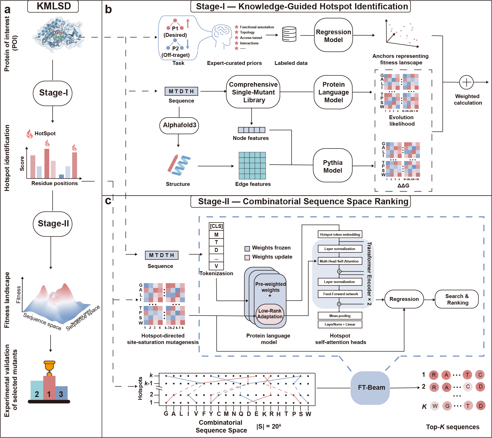

# KMLSD Framework



KMLSD combines Stage-I hotspot prioritization with Stage-II surrogate-guided
combinatorial ranking. This repository contains the P450 (CYP107D1) and GB1 examples.

## Experimental data

The current P450 experimental measurements are available in
[data/P450/experimental](data/P450/experimental/README.md):

| Dataset | Records | Excel | CSV |
| --- | ---: | --- | --- |
| Alanine scanning | 85 variants | [alanine_scanning.xlsx](stage1_data/p450/alanine_scanning.xlsx) | [alanine_scanning.csv](stage1_data/p450/alanine_scanning.csv) |
| Six-site saturation mutagenesis | 114 variants | [saturation_mutagenesis.xlsx](data/P450/saturation_mutagenesis.xlsx) | [saturation_mutagenesis.csv](data/P450/saturation_mutagenesis.csv) |
| OM3 reference | 1 reference | [om3_reference.xlsx](data/P450/experimental/om3_reference.xlsx) | [om3_reference.csv](data/P450/experimental/om3_reference.csv) |

These files report mean UDCA and MDCA yields, selectivities, and conversion.
The CSV files preserve the measurements supplied in the Excel workbooks.
The saturation CSV also includes the six-letter `Combo` identifier used by
Stage-II. These two scanning tables replace the previous input tables.
The supplied checkpoints and saved rankings predate this data update; their
original inputs are available in the repository history.

## Setup

```bash
git lfs install
git lfs pull
conda env create -f environment.kmlsd.yml
conda activate KMLSD
```

Place the ESM2 650M base-model weights, configuration and tokenizer in
`model/esm2_650M/`. LoRA checkpoints do not include the base model. Commands below
use Bash line continuations; enter them on one line in PowerShell.

## Stage-I: P450

The manuscript ranking is in [stage1_scores.csv](stage1_data/p450/stage1_scores.csv)
and [top6.csv](stage1_data/p450/top6.csv). These saved results predate the
measurement update. Score the current alanine measurements with:

```bash
python stage1/score_hotspots.py \
  --in_dir stage1_data/p450 --out_dir outputs/p450_stage1 \
  --protocol corrected --topk 6 --srs_only \
  --w_model 0.8 --w_alpha 0.8 --w_alpha_udca_sel 0.5 \
  --w_alpha_mdca 0 --w_alpha_mdca_sel 0 --w_delta 0.8 --w_lambda 0.5 \
  --plm_csv stage1_data/p450/plm_srs_site_summary.csv --w_plm 0.4 \
  --ddg_csv stage1_data/p450/ddg_srs_site_summary.csv --w_ddg 0.5
```

| Rank | Position | Score (rounded) |
| --- | --- | --- |
| 1 | G294 | 5.50 |
| 2 | S68 | 4.90 |
| 3 | V192 | 4.04 |
| 4 | T173 | 3.14 |
| 5 | Q96 | 2.91 |
| 6 | F296 | 2.78 |

The 99 positions include 85 measured labels. The input reader maps `Variant`
to its position and `YUDCA` to the prediction target. The other reported
measurement columns remain available in the data table. No risk indicators are
supplied in the new measurement table, so their contributions default to zero.
The default `corrected` protocol excludes missing labels from training.
Each run records the input file, target column and input hashes in
`score_metadata.json`. Legacy tables containing `ref_pos` and `y` can be supplied
explicitly with `--labels_csv`; the `paper` protocol remains available for them.

GB1's Stage-I table has four observed sites and 52 padded background positions;
it is illustrative, not a whole-sequence hotspot-discovery benchmark.

## Stage-II: GB1 results

The [candidate pool](results/lora_plm/gb1_beam/beam_all_final.csv), model and
[metrics](results/lora_plm/gb1_beam/metrics.json) correspond to the manuscript run.

```bash
python scripts/evaluate_gb1.py --verify-reference
```

Evaluation matches candidates to measured fitness, excludes the 76 training
combinations, and selects the top 10 by predicted score. Spearman and
shifted-linear NDCG use these same ten candidates.

| Best true rank | Mean true rank | Best fitness | Spearman | NDCG@10 |
| --- | --- | --- | --- | --- |
| 90 | 596 | 5.075299437 | 0.7333333333 | 0.9165237499 |

```bash
python lora_plm/predict.py \
  --model_path model/esm2_650M --peft_dir results/lora_plm/gb1_siteattn \
  --wt_fasta data/GB1/GB1_WT.fasta --crossmap data/GB1/gb1_refpos_crossmap.csv \
  --enzyme_name GB1 --ref_positions 39,40,41,54 \
  --candidates_csv results/lora_plm/gb1_beam/beam_all_final.csv \
  --out_csv outputs/gb1_rescored.csv --device cuda --local_files_only
```

## Stage-II: training and search

New training uses one-based biological positions converted to zero-based sequence
indices. Supplied checkpoints retain their original indexing in `meta.txt`;
newly trained models require their own evaluation.

```bash
python lora_plm/train.py \
  --model_path model/esm2_650M --wt_fasta WT.fasta \
  --crossmap stage1_data/p450/refpos_crossmap.csv --enzyme_name CYP107D1 \
  --ref_positions 68,96,173,192,294,296 \
  --train_csv data/P450/saturation_mutagenesis.csv --obj_col YUDCA \
  --head sixsite_attn --attn_heads 4 --attn_layers 2 \
  --epochs 12 --batch_size 2 --lr 1e-4 \
  --out_dir outputs/p450_model --device cuda --local_files_only

python beam/beam_search_lora.py \
  --model_path model/esm2_650M --peft_dir outputs/p450_model \
  --wt_fasta WT.fasta --crossmap stage1_data/p450/refpos_crossmap.csv \
  --enzyme_name CYP107D1 --ref_positions 68,96,173,192,294,296 \
  --out_dir outputs/p450_beam --beam 256 --epsilon 0.05 \
  --seeds_from_singles 400 --device cuda --local_files_only
```

For GB1, use `data/GB1/GB1_WT.fasta`, `data/GB1/gb1_refpos_crossmap.csv`,
`--enzyme_name GB1 --ref_positions 39,40,41,54`, and
`--train_csv data/GB1/gb1_stage2_train.csv --obj_col Fitness --head site_attn`.
Save each new model to an empty output directory. Prediction and beam search read
the architecture and indexing from checkpoint metadata and require all head weights.

P450 six-letter candidates use site order 68, 96, 173, 192, 294, 296.
`data/P450/all_combos.csv` is an older five-site input and is not compatible with
this six-site protocol. A valid small example is `data/P450/six_site_example.csv`.

## Checks

```bash
python -m unittest discover -s tests -v
```
